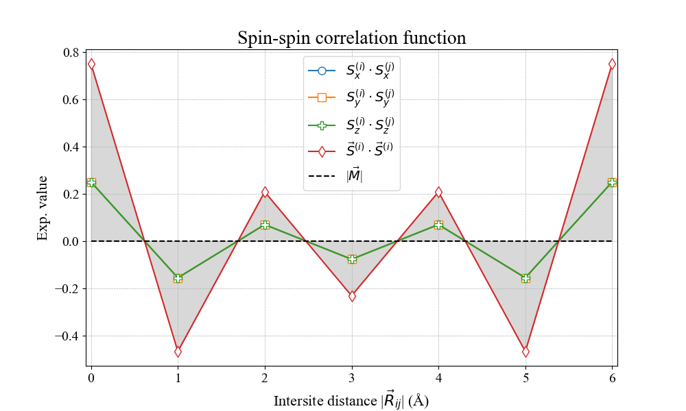
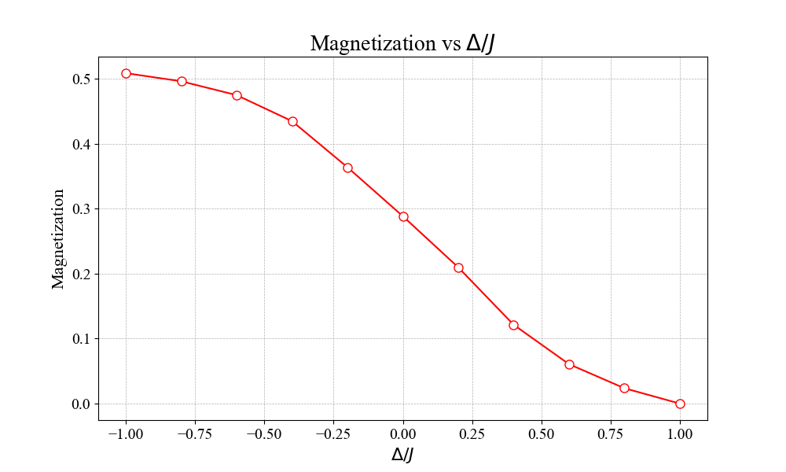
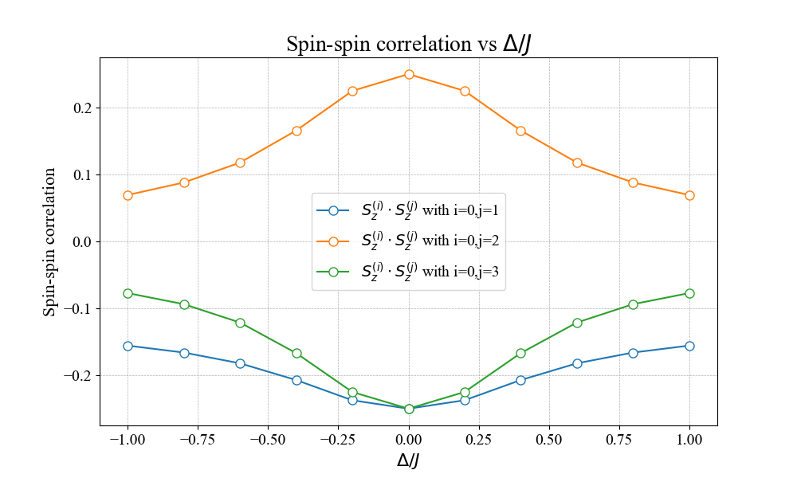

**<h1 style="text-align: center; font-size: 3em;">AFM Heisenberg Chain</h1>**

**<h2 style="font-size: 2em;">Table of Contents</h2>**
- [Single-run calculation](#single-run-calculation)
- [Dependence on the (diagonal) anisotropic exchange interactions](#dependence-on-the-diagonal-anisotropic-exchange-interactions)

## Single-run calculation

First of all, install PyLasm as specified in README.md and prepare the following input files into a working directory.

- **init_config.ini** = Minimal configuration file (default settings are enough, apart from these 5 variables);

~~~
[STRUCTURE]

struct_file_name = 'POSCAR_Ce_6x1x1.vasp'
mag_ion = 'Ce'

[HAMILTONIAN]

J_couplings_file = 'J_couplings.dat'

[OUTPUT]

n_excited = 1
magn_output_mode = 'M_full'
~~~

- **J_couplings.dat** = File storing the 1°NN intersite exchange tensors of the AFM Heisenberg model;

~~~
 -----INTERACTION: Ce0_0 - Ce0_0

Shell=0

Coor_num = 2

Dipole-Dipole interactions

 R = [1.889725988 0. 0.     ]
 T = [1.889725988 0. 0.      ]

              y         z         x     
    y       1.000     0.000     0.000   
    z       0.000     1.000     0.000  
    x       0.000     0.000     1.000   

 R = [-1.889725988 0. 0.     ]
 T = [-1.889725988 0. 0.      ]

              y         z         x     
    y       1.000     0.000     0.000   
    z       0.000     1.000     0.000  
    x       0.000     0.000     1.000
~~~

- **POSCAR_Ce_6x1x1.vasp** = Structural properties of the chain in the POSCAR format (ions are equally-spaced by 1Å).

~~~
Keep 1 Angstroms of distance between 1° NN sites
1.0
        6.0000000000         0.0000000000         0.0000000000
        0.0000000000        20.0000000000         0.0000000000
        0.0000000000         0.0000000000        20.0000000000
   Ce
    6
Cartesian
     0.000000000         0.000000000         0.000000000
     1.000000000         0.000000000         0.000000000
     2.000000000         0.000000000         0.000000000
     3.000000000         0.000000000         0.000000000
     4.000000000         0.000000000         0.000000000
     5.000000000         0.000000000         0.000000000
~~~

Now, copy and paste **exec_single_run.ipynb** from Scripts within the PyLasm installation folder to the chosen working directory. As indicated in exec_single_run.ipynb, substitute the main_path value properly.

Then, choose the execution method that suits you. Please find here a list of valid options: 
- run the code blocks manually within a source code editor (such as Visual Studio Code) if compatible with Jupyter Notebooks;
- run the code blocks through the Jupyter Notebook Dashboard by the command

```jupyter notebook exec_single_run.ipynb```

- run all the code blocks at once by the command

```jupyter nbconvert --to notebook --execute exec_single_run.ipynb```

In conclusion, find the numerical results within the **SPIN_OUT.json** output file: the converged Lanczos energies for the ground state and/or first excited one, the spin-spin correlation values for all the available spin pairs and the magnetization modulus.

~~~
{
    "Lanczos Energies": [
        -2.8027756377,
        -2.1180339887,
        -2.1180339887,
        -2.1180339887
    ],
    "Spin-Spin Corr. Matrices": {
        "X components": {
            "Spins 0-0": 0.25000000000000006,
            "Spins 0-1": -0.1557097576517775,
            "Spins 0-2": 0.06933752452815367,
            "Spins 0-3": -0.07725553375275233,
            "Spins 0-4": 0.06933752452815366,
            "Spins 0-5": -0.15570975765177747,
            (...)
            "Spins 5-4": -0.15570975765177747,
            "Spins 5-5": 0.25000000000000006
        },
        "Y components": {
            "Spins 0-0": 0.25000000000000006,
            "Spins 0-1": -0.1557097576517775,
            "Spins 0-2": 0.06933752452815366,
            "Spins 0-3": -0.07725553375275233,
            "Spins 0-4": 0.06933752452815366,
            "Spins 0-5": -0.15570975765177747,
            (...)
            "Spins 5-4": -0.15570975765177747,
            "Spins 5-5": 0.25000000000000006
        },
        "Z components": {
            "Spins 0-0": 0.25000000000000006,
            "Spins 0-1": -0.15570975765177753,
            "Spins 0-2": 0.06933752452815369,
            "Spins 0-3": -0.07725553375275233,
            "Spins 0-4": 0.06933752452815366,
            "Spins 0-5": -0.1557097576517775,
            (...)
            "Spins 5-4": -0.1557097576517775,
            "Spins 5-5": 0.25000000000000006
        },
        "Total": {
            "Spins 0-0": 0.75,
            "Spins 0-1": -0.4671292729553325,
            "Spins 0-2": 0.208012573584461,
            "Spins 0-3": -0.231766601258257,
            "Spins 0-4": 0.20801257358446096,
            "Spins 0-5": -0.46712927295533246,
            (...)
            "Spins 5-4": -0.46712927295533246,
            "Spins 5-5": 0.75
        }
    },
    "Magnetization Modulus": 1.591336336816401e-09
}
~~~

Also, compare the so obtained **SPIN_CORRS.png** with the following figure



## Dependence on the (diagonal) anisotropic exchange interactions

Just take exactly the same structural properties (i.e. POSCAR_Ce_6x1x1.vasp), but modify the configuration file and the magnetic interactions (i.e. init_config.ini and J_couplings.dat). Since there are several ways to parametrize the intersite exchange tensors, the user is tasked with preparing the J_couplings_file for each PyLasm execution. 

This example refers to the following spin anisotropy parametrization:

~~~
 -----INTERACTION: Ce0_0 - Ce0_0

Shell=0

Coor_num = 2

Dipole-Dipole interactions

 R = [1.889725988 0. 0.     ]
 T = [1.889725988 0. 0.      ]

              y         z         x     
    y       Delta     0.000     0.000   
    z       0.000     1.000     0.000  
    x       0.000     0.000     Delta   

 R = [-1.889725988 0. 0.     ]
 T = [-1.889725988 0. 0.      ]

              y         z         x     
    y       Delta     0.000     0.000   
    z       0.000     1.000     0.000  
    x       0.000     0.000     Delta
~~~

with Delta in [-1.0,-0.8,-0.6,-0.4,-0.2,0.0,0.2,0.4,0.6,0.8,1.0].

Note that the configuration within each sub-directory is automatically modified in order to read the appropriate J_coupling_file.

Next, copy and paste **exec_multiple_J_runs.ipynb** from Scripts within the PyLasm installation folder to the chosen working directory. As indicated in exec_multiple_J_runs.ipynb, assign the values that suits you to the variables within the second code block.
Here are the values to reproduce the outcomes given in this example.

~~~
J_files_num = 11 
J_couplings_files = [f'J_couplings_{i}.dat' for i in range(J_files_num)]
J_params = np.linspace(-1.0,1.0,J_files_num)
spin_pairs = [(0,1),(0,2),(0,3)]
SSC_type = 'Z components'
~~~

Once all the Pylasm calculations within the sub-directories run_* are finished, find the output plots under the name of **M_vs_Jpar.png** and **SSC_vs_Jpar.png**, which respectively show how the magnetization and the chosen spin-spin correlation function is affected by the variation of the exchange anisotropy parameter Delta.




Finally, if the just performed PyLasm single-runs are no longer useful to the user, reduce the memory space occupied by the subdirectories by removing all the files they contain apart from SPIN_OUT.json and SPIN_REPORT.txt. This can be easily achieved by running the python script **clean_directory.py** (find it in the Scripts of the PyLasm installation folder) within the working directory.
